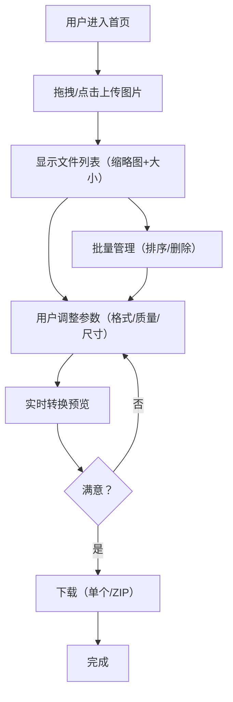

## 1. 产品概述

PixConvert 是一款超越 towebp.io 的新一代浏览器端图片格式转换工具。支持 WebP、AVIF 双格式输出，同时提供反向转换（WebP/AVIF → JPG/PNG），具备智能压缩、图片编辑、批量处理等能力。所有处理均在浏览器本地完成，零上传，保护用户隐私。

- **核心价值**：一站式图片格式转换与优化，覆盖 WebP + AVIF 双现代格式，比 towebp.io 多出 AVIF 支持、反向转换、图片编辑等关键能力
- **目标用户**：前端开发者、网站运营、设计师、SEO 优化人员、普通用户

## 2. 核心功能

### 2.1 功能模块

1. **转换器主页**：格式转换核心功能，包含文件上传、参数设置、预览对比、批量下载
2. **格式对比页**：原始 vs WebP vs AVIF 可视化对比，帮助用户理解各格式优劣
3. **常见问题页**：FAQ 问答

### 2.2 页面详情

| 页面名称 | 模块名称 | 功能描述 |
|---------|---------|---------|
| 转换器主页 | Hero 区域 | 产品名称、一句话描述、CTA 按钮（跳转到转换功能区） |
| 转换器主页 | 文件上传区 | 拖拽上传 + 点击上传，支持 JPG/PNG/GIF/SVG/ICO/BMP/HEIC/TIFF/AVIF/WebP，显示文件列表（缩略图、文件名、原始大小），支持批量删除和清空，支持拖拽排序 |
| 转换器主页 | 参数设置面板 | 输出格式选择（WebP/AVIF），质量滑块（1-100），尺寸缩放（0.1x-4x），预设方案选择（极致压缩/平衡/极致质量），元数据处理（保留/清除），转换模式（有损/无损） |
| 转换器主页 | 预览对比区 | 原图与转换后并排对比，滑块对比模式（拖动查看差异），显示文件大小变化（百分比 + 绝对值），SSIM 相似度评分 |
| 转换器主页 | 批量操作区 | 全选/取消全选，一键下载全部（ZIP），逐一下载，格式转换统计摘要 |
| 转换器主页 | 快捷工具栏 | 深色/浅色模式切换，键盘快捷键提示，历史记录入口 |
| 格式对比页 | 格式对比区 | 三栏对比（原始/WebP/AVIF），展示同一图片在不同格式下的文件大小和质量差异，交互式对比滑块 |
| 常见问题页 | FAQ 列表 | 折叠式问答，覆盖 WebP/AVIF 基础知识、使用场景、兼容性等 |

## 3. 核心流程

## 4. 用户界面设计

### 4.1 设计风格

- **主题**：深色工业风（Dark Industrial），默认深色模式，支持一键切换浅色模式
- **主色调**：深灰背景 `#0D0D0D`，霓虹青 `#00F5A0` 作为强调色，辅以暖橙 `#FF6B35` 用于交互元素
- **字体**：标题使用 "Geist" 或 "DM Sans"（现代几何无衬线），正文使用 "JetBrains Mono" 用于数据展示（等宽字体增强技术感）
- **按钮**：圆角矩形（8px），悬停时微发光效果（box-shadow glow），主按钮填充霓虹青，次按钮描边
- **布局**：单页应用，功能区域垂直排布，卡片式模块，大量留白
- **图标**：Lucide Icons（简洁线性图标）
- **动效**：页面加载错落入场动画，卡片悬停微妙上浮，转换完成脉冲动画，粒子背景效果

### 4.2 页面设计概览

| 页面名称 | 模块名称 | UI 元素 |
|---------|---------|---------|
| 转换器主页 | Hero 区域 | 大标题居中，渐变文字效果，霓虹青下划线装饰，动态粒子背景，CTA 按钮居中下方 |
| 转换器主页 | 文件上传区 | 虚线边框拖拽区域（200px 高），中央上传图标 + 文字提示，上传后变为网格缩略图列表（4列），每项含缩略图/文件名/大小/删除按钮 |
| 转换器主页 | 参数设置面板 | 横向展开的卡片面板，左侧格式选择标签切换，中间质量滑块带刻度标记，右侧预设方案下拉，折叠式高级选项 |
| 转换器主页 | 预览对比区 | 左右分栏并排对比，上方滑块对比模式，下方显示文件大小对比（进度条 + 百分比），SSIM 数值徽章 |
| 格式对比页 | 格式对比区 | 三栏布局，每栏显示同图不同格式，顶部交互式滑块拖动对比，底部文件大小柱状图 |

### 4.3 响应式设计

- 桌面端优先（1440px 基准），最大宽度 1200px 居中
- 平板端（768px-1024px）：文件列表 3 列，预览对比上下排布
- 移动端（<768px）：文件列表 2 列，参数面板纵向堆叠，预览对比改为上下排布，Hero 文字缩小

## 5. 超越 towebp.io 的差异化策略

| 维度 | towebp.io | PixConvert（本产品） |
|------|-----------|---------------------|
| 输出格式 | 仅 WebP | WebP + AVIF 双格式 |
| 反向转换 | 不支持 | WebP/AVIF → JPG/PNG |
| 输入格式 | 7 种 | 10 种（+HEIC/TIFF/RAW） |
| 格式对比 | 无 | 原图 vs WebP vs AVIF 三栏对比 |
| 图片编辑 | 无 | 裁剪/旋转/翻转 |
| 元数据控制 | 无 | 保留/清除 EXIF |
| 转换模式 | 仅有损 | 有损 + 无损模式 |
| 预设方案 | 无 | 极致压缩/平衡/极致质量 |
| 主题 | 仅浅色 | 深色/浅色双模式 |
| SSIM 评分 | 无 | 内置相似度评估 |
| PWA | 否 | 是（可离线使用） |
| 历史记录 | 无 | IndexedDB 本地历史 |