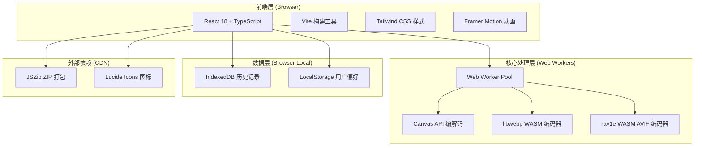
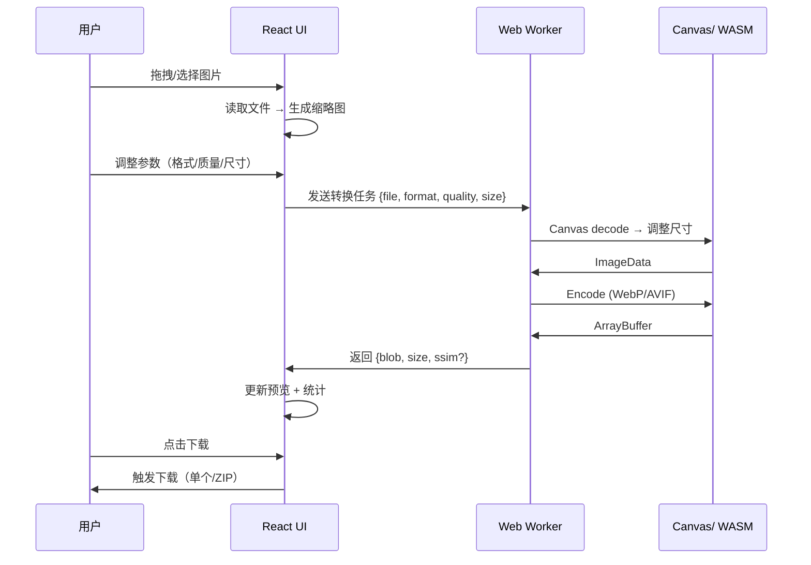

## 1. 架构设计



## 2. 技术栈

- **前端框架**：React 18 + TypeScript
- **构建工具**：Vite 5
- **样式方案**：Tailwind CSS 3 + CSS Variables
- **动画库**：Framer Motion
- **图标**：Lucide React
- **图片处理**：
  - Canvas API（toBlob）用于 WebP 转换
  - libwebp WASM（webp_enc）用于高质量 WebP 编码
  - 浏览器原生 AVIF 编码（Chrome/Firefox 已支持）
  - JSZip 用于 ZIP 打包下载
- **数据存储**：IndexedDB（Dexie.js）存储转换历史，LocalStorage 存储用户偏好
- **后端**：无（纯前端 SPA，静态托管）
- **部署**：GitHub Pages / Vercel / Cloudflare Pages

## 3. 路由定义

| 路由 | 页面 | 说明 |
|------|------|------|
| `/` | 转换器主页 | 核心转换功能，默认页面 |
| `/compare` | 格式对比页 | 原始/WebP/AVIF 可视化对比 |
| `/faq` | 常见问题 | FAQ 列表 |

## 4. 组件树

```
App
├── Layout
│   ├── Header (Logo + 导航 + 主题切换)
│   └── Footer
├── Pages
│   ├── HomePage (路由: /)
│   │   ├── HeroSection (标题 + CTA)
│   │   ├── FileUploadZone (拖拽上传)
│   │   ├── FileList (缩略图网格)
│   │   ├── SettingsPanel (参数设置)
│   │   │   ├── FormatSelector (WebP/AVIF)
│   │   │   ├── QualitySlider (质量滑块)
│   │   │   ├── SizeScaler (尺寸缩放)
│   │   │   ├── PresetSelector (预设方案)
│   │   │   └── AdvancedOptions (高级选项)
│   │   ├── PreviewComparison (原图 vs 转换后)
│   │   │   ├── SplitView (并排对比)
│   │   │   ├── SliderCompare (滑块对比)
│   │   │   └── StatsBar (大小变化统计)
│   │   └── BatchActions (批量下载/清空)
│   ├── ComparePage (路由: /compare)
│   │   └── FormatCompare (三栏格式对比)
│   └── FAQPage (路由: /faq)
│       └── AccordionList (折叠问答)
├── Common
│   ├── Modal
│   ├── Toast
│   ├── Tooltip
│   └── KeyboardShortcuts
└── Hooks
    ├── useImageConverter (核心转换逻辑)
    ├── useFileUpload (文件处理)
    ├── useWorkerPool (Worker 管理)
    └── useHistory (IndexedDB 历史)
```

## 5. 核心数据流



## 6. 数据模型

### 6.1 类型定义

```typescript
// 转换任务
interface ConversionTask {
  id: string;
  file: File;
  originalSize: number;
  thumbnailUrl: string;
  status: 'pending' | 'converting' | 'done' | 'error';
  result?: ConversionResult;
  error?: string;
}

// 转换结果
interface ConversionResult {
  blob: Blob;
  convertedSize: number;
  sizeReduction: number; // 百分比
  ssim?: number; // 结构相似度评分
  format: 'webp' | 'avif';
}

// 转换设置
interface ConversionSettings {
  outputFormat: 'webp' | 'avif';
  quality: number; // 1-100
  scale: number; // 0.1 - 4.0
  mode: 'lossy' | 'lossless';
  preserveMetadata: boolean;
  preset: 'extreme' | 'balanced' | 'maxQuality' | 'custom';
}

// 历史记录
interface HistoryEntry {
  id: string;
  timestamp: number;
  originalName: string;
  originalFormat: string;
  originalSize: number;
  outputFormat: string;
  convertedSize: number;
  settings: ConversionSettings;
}
```

### 6.2 IndexedDB Schema (Dexie.js)

```typescript
const db = new Dexie('PixConvertDB');
db.version(1).stores({
  history: '++id, timestamp, originalFormat, outputFormat',
  presets: '++id, name'
});
```

## 7. 性能优化策略

- **Web Worker 线程池**：最多 4 个 Worker 并行处理，避免阻塞主线程
- **懒加载**：libwebp WASM 和 AVIF 编码器按需加载
- **虚拟列表**：文件超过 50 个时启用虚拟滚动
- **缩略图缓存**：使用 URL.createObjectURL 复用缩略图
- **Service Worker**：缓存静态资源和 WASM 模块，支持离线使用
- **代码分割**：React.lazy + Suspense 按路由分割